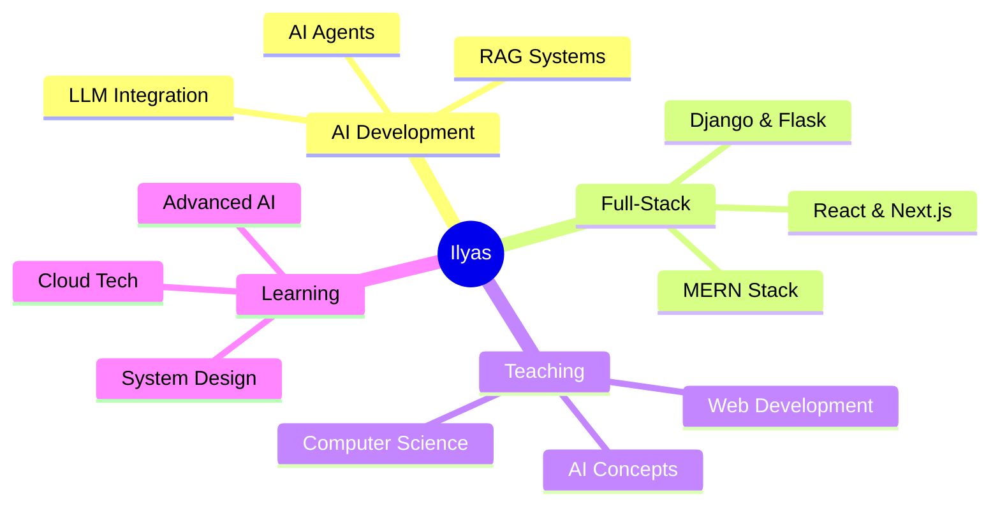

<div align="center">
  
</div>

<div align="center">
  
[](https://git.io/typing-svg)


</div>

<br>


##  About Me

```typescript
const ilyas = {
    education: "Master's in Computer Science 🎓",
    university: "University of Chlef",
    role: "Assistant Lecturer & AI Engineer",
    currentFocus: ["AI Agents", "RAG Systems", "LLMs"],
    tech: {
        frontend: ["React", "Next.js", "TypeScript"],
        backend: ["Django", "Flask", "Node.js"],
        ai: ["LangChain", "OpenCV", "LLMs"],
        databases: ["MongoDB", "PostgreSQL", "Supabase"]
    },
    motto: "Building intelligent systems that make a difference ⚡"
};
```

<br clear="right"/>

---

## 🎯 What I Do

<table>
  <tr>
    <td align="center" width="33%">
      
      <br><b>AI Development</b>
      <br><sub>Building intelligent agents & RAG systems</sub>
    </td>
    <td align="center" width="33%">
      
      <br><b>Full-Stack Dev</b>
      <br><sub>Modern web applications with React & Django</sub>
    </td>
    <td align="center" width="33%">
      
      <br><b>Teaching</b>
      <br><sub>Assistant Lecturer in Computer Science</sub>
    </td>
  </tr>
</table>

---

## 🛠️ Tech Stack

<div align="center">

### 💻 Languages


### 🎨 Frontend


### ⚙️ Backend


### 🤖 AI & ML


### 🗄️ Databases


### 🔧 Tools & Platform


</div>

---

## 📊 GitHub Analytics

<div align="center">
  
  
</div>

<div align="center">
  
  
</div>

<div align="center">
  
</div>

---

## 🎯 Current Focus

<div align="center">



</div>

<table align="center">
  <tr>
    <td>🔭</td>
    <td><b>Working on:</b> AI-powered educational platforms & network diagnostics tools</td>
  </tr>
  <tr>
    <td>🌱</td>
    <td><b>Learning:</b> Advanced AI agent architectures & LLM integration</td>
  </tr>
  <tr>
    <td>👯</td>
    <td><b>Collaborate on:</b> LLM integration projects & RAG systems</td>
  </tr>
  <tr>
    <td>💬</td>
    <td><b>Ask me about:</b> React, Next.js, Django, AI, RAG systems</td>
  </tr>
  <tr>
    <td>📚</td>
    <td><b>Teaching:</b> Assistant Lecturer in Computer Science</td>
  </tr>
  <tr>
    <td>🌐</td>
    <td><b>Portfolio:</b> <a href="https://portfolio-lemon-three-87.vercel.app">portfolio-lemon-three-87.vercel.app</a></td>
  </tr>
</table>

---

## 🤝 Connect With Me

<div align="center">

[](https://linkedin.com/in/ilyas-ali-benyahia-a411b6330)
[](https://github.com/ilyas-ali-benyahia)
[](mailto:ilyasalibenyahia@gmail.com)
[](https://portfolio-lemon-three-87.vercel.app)

</div>

---

<div align="center">

### 💡 Quote of the Day


</div>

---

<div align="center">

### 🐍 Contribution Snake


</div>

---

<div align="center">

### ⚡ Recent Activity

<!--START_SECTION:activity-->
<!--END_SECTION:activity-->

</div>

---

<div align="center">
  
**"Building intelligent systems that make a difference"** ⚡


</div>
